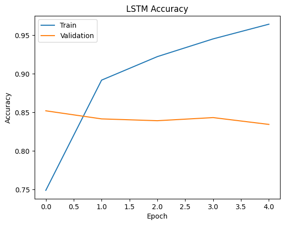

# 🚀 Advanced Sentiment Analysis using NLP & Deep Learning

## 📌 Overview
This project implements an end-to-end Natural Language Processing (NLP) pipeline to classify movie reviews as Positive or Negative.

It includes both traditional Machine Learning and Deep Learning approaches for comparison.

---

## ⚙️ Technologies Used
- Python
- Pandas, NumPy
- Scikit-learn
- TensorFlow / Keras
- NLP (TF-IDF, Tokenization)
- Matplotlib, Seaborn

---

## 📊 Dataset
IMDb Movie Reviews Dataset:
- 50,000 reviews
- Balanced dataset

---

## 🧠 Models Implemented

### 🔹 1. Naive Bayes (Machine Learning)
- TF-IDF Vectorization
- Fast and efficient baseline model

### 🔹 2. Neural Network
- Embedding Layer
- Dense Layers

### 🔹 3. LSTM (Deep Learning)
- Sequence modeling
- Captures context in text

### 🔹 4. Bidirectional LSTM
- Processes text forward and backward
- Improves understanding of context

---

## 📈 Model Performance

| Model | Accuracy |
|------|---------|
| Naive Bayes | ~86% |
| Neural Network | ~65% |
| LSTM | ~84% |
| BiLSTM | ~85-88% |

---

## 📊 Visualizations

### 🔹 Training Curve


### 🔹 Confusion Matrix


---

## 💡 Example Predictions

- "I love this movie" → Positive 😊  
- "Worst movie ever" → Negative 😡  

---

## 🚀 How to Run

```bash
pip install -r requirements.txt
2. Run notebook in Jupyter or Colab

---

## 👨‍💻 Author
Ahmed Essam
